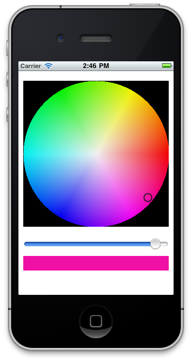

# Class Files:

## RSColorPickerView

Square (circle) color-picker that handles touch events and allows for brightness control. Uses delegation to report color selection as-changed

## RSBrightnessSlider

Basic UISlider subclass that can be used easily with RSColorPickerView. 

# Project:

Inspired by [ANColorPicker](https://github.com/unixpickle/ANColorPicker). 
Uses formulas from [EasyRGB](http://www.easyrgb.com/index.php?X=MATH&H=21#text21) (HSV conversions). 
Also uses [ANImageBitmapRep](https://github.com/unixpickle/ANImageBitmapRep) for easy pixel-level manipulation. 

And of course, thanks to [Wikipedia](http://en.wikipedia.org/wiki/HSL_and_HSV).

# Usage:

See included example project (application delegate).

## Requirements:

* QuartzCore.framework
* CoreGraphics.framework
* UIKit.framework
* Foundation.framework
* ANImageBitmapRep (Included)

***

